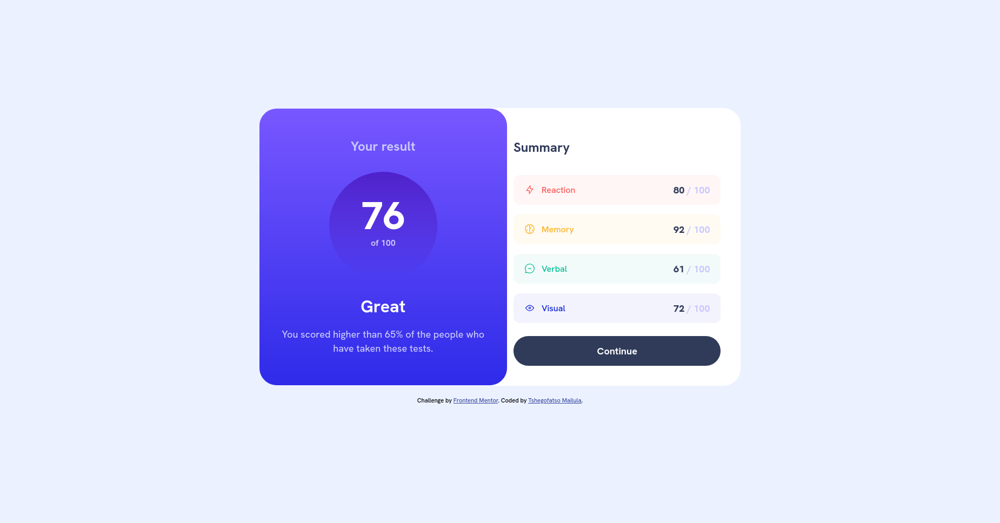
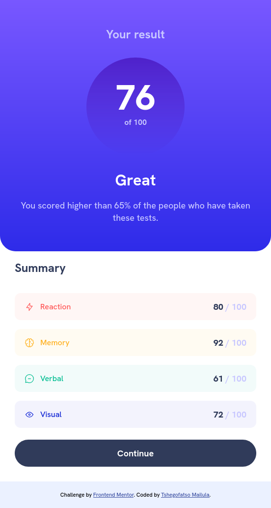

# Frontend Mentor - Results summary component solution

This is a solution to the [Results summary component challenge on Frontend Mentor](https://www.frontendmentor.io/challenges/results-summary-component-CE_K6s0maV). Frontend Mentor challenges help you improve your coding skills by building realistic projects. 

## Table of contents

- [Overview](#overview)
  - [The challenge](#the-challenge)
  - [Screenshots](#screenshots)
  - [Links](#links)
- [My process](#my-process)
  - [Built with](#built-with)
  - [What I learned](#what-i-learned)
  - [Continued development](#continued-development)
  - [Useful resources](#useful-resources)
- [Author](#author)
- [Acknowledgments](#acknowledgments)

## Overview

### The challenge

Users should be able to:

- View the optimal layout for the interface depending on their device's screen size
- See hover and focus states for all interactive elements on the page
- **Bonus**: Use the local JSON data to dynamically populate the content

### Screenshots

<table>
  <tr>
    <td></td>
    <td></td>
  </tr>
</table>

### Links

- Solution URL: [https://github.com/TshegofatsoMailula/results-summary-component-bootcamp-final-assessment]
- Live Site URL: [https://tshegomailula.vercel.app/]

## My process

### Built with

- Semantic HTML5 markup
- CSS (Flexbox)
- Javascript
- Responsive design

### What I learned

Two key takeaways from working on this challenge were learning more about HTML5 semantic elements and strengthening my understanding of CSS3 concepts, particularly Flexbox and media queries.

In previous projects, I often relied on div elements to structure sections of a webpage. As projects grew larger, the HTML became more difficult to read and maintain. Learning about HTML5 semantic elements showed me how they can improve code organisation, readability, and accessibility by clearly defining the purpose of different sections of a page.

I also gained a deeper understanding of Flexbox. Instead of using tables for page layouts, I learned how to create responsive layouts with CSS Flexbox, which offers greater flexibility and control over the positioning of elements.

**For example, using semantic elements:**

```html
<section>
  <h1>This is a section</h1>
</section>
```

**instead of:** 

```html
<div id="h1-section">
  <h1>This is a section</h1>
</div>
```

**And using Flexbox for layout:**

```css
.two-column-layout {
  display: flex;
  flex-direction: row;
}
```
**with:**

```html
<section class="two-column-layout">
  <div>Column 1</div>
  <div>Column 2</div>
</section>
```

**instead of:**

```html
<table>
  <tr>
    <td>Column 1</td>
    <td>Column 1</td>
  </tr>
</table>
```

### Continued development

Before attending the bootcamp, I relied heavily on CSS frameworks to build interfaces without fully understanding many core CSS concepts. Through this project and the bootcamp, I developed a deeper appreciation for the importance of strong CSS fundamentals. Going forward, I plan to continue improving my CSS skills, focusing on layout techniques, responsiveness, and accessibility to create more user-friendly and maintainable websites.

### Useful resources

- [HTML5 Semantic Elements](https://www.w3schools.com/html/html5_semantic_elements.asp) - Helped me better understand semantic HTML and how to structure web pages for accessibility and readability.
- [CSS Flexbox](https://www.w3schools.com/css/css3_flexbox.asp) - Helped me learn how to build responsive layouts using Flexbox.
- [JavaScript Async Fetch](https://www.w3schools.com/js/js_async_fetch.asp) - Taught me how to fetch data asynchronously from a JSON file and display it dynamically on the webpage.
- [Responsive Web Design](https://www.w3schools.com/css/css_rwd_intro.asp) - Helped me understand responsive web design and how to use media queries to adapt layouts for different devices and screen sizes.

## Author

- Website - [Tshegofatso Mailula](https://tshegomailula-portfolio.vercel.app)
- Frontend Mentor - [@TshegofatsoMailula](https://www.frontendmentor.io/profile/TshegofatsoMailula)


## Acknowledgments

Shoutout to the team at mLab Southern Africa for an insightful 3-week CodeTribe Bootcamp.

What started as an introduction to programming became a valuable learning experience, covering the different stages of web development through hands-on projects and practical guidance. Each phase was facilitated by experienced professionals who shared both technical knowledge and industry insights.

Special thanks to:

- Ms. Mahlatse Seriti – HTML & CSS
- Mr. Sabelo Gumede – JavaScript
- Mr. Frankie Mosehla – Web Hosting (Vercel)

I appreciate the opportunity and the knowledge gained throughout the programme.
